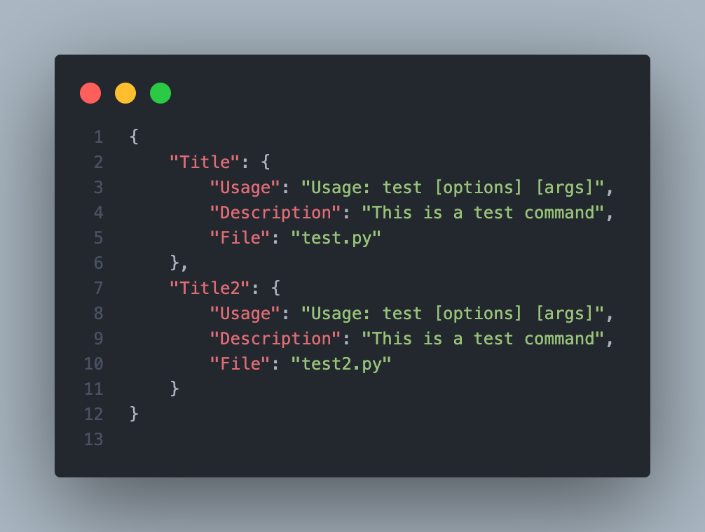

# AeroPrompt

The Terminal Multi-Tool, crafted entirely in Python, is your solution for streamlined system analysis and versatile command-line tasks.

## Install AeroPrompt
To install AeroPrompt, open your macOS Terminal or Linux shell and paste the following command:

```sh
/bin/bash -c "$(curl -fsSL https://raw.githubusercontent.com/Robobo2022/AeroPrompt/main/Main/Core/install.sh)"
```

## Want to add custom scripts?
To get started with adding your custom scripts, follow these steps:

1. **Navigate to the Custom Folder:**
   
   Go to the [Custom folder](./Main/Custom/).

2. **Open the JSON File:**
   
   Open the [commands.json](./Main/Custom/commands.json) file in a text editor.

3. **Edit the JSON File:**

    Inside the `commands.json` file, you'll see entries for different scripts. Each entry includes details like usage, description, and the associated script file. For example:

    

4. **Add Your Script:**

    Place your script file in the [Scripts Folder](./Main/Custom/scripts).

